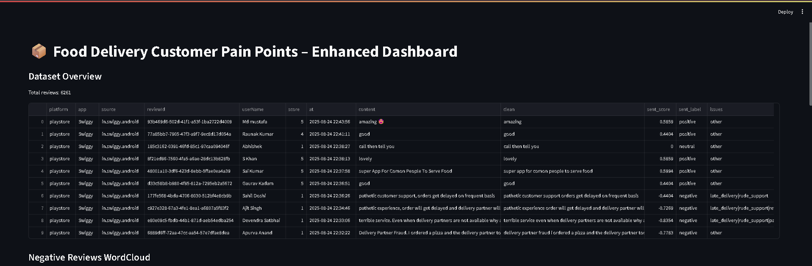
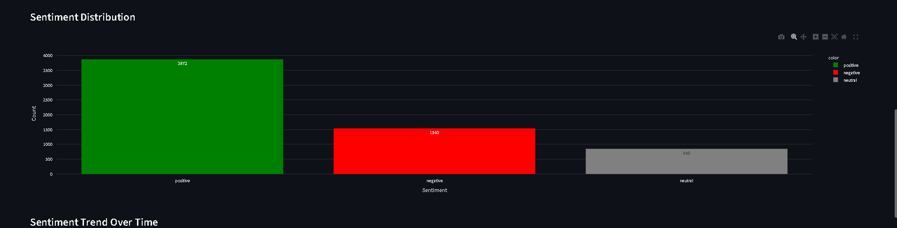
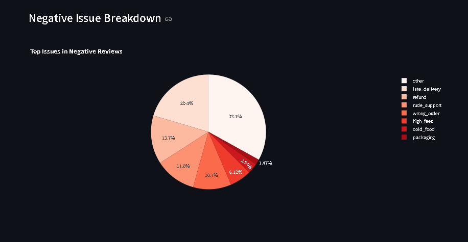
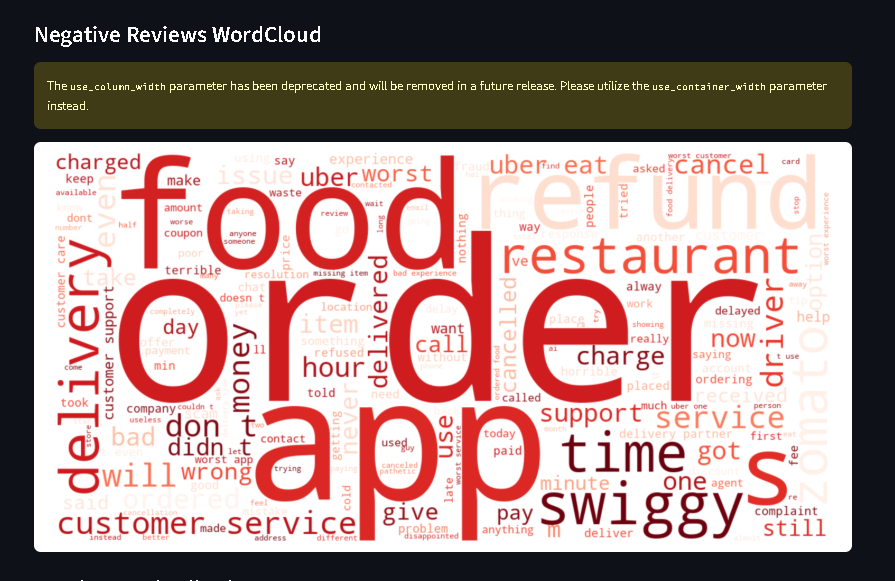
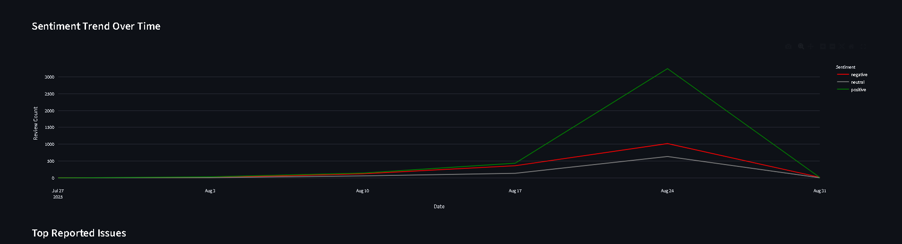

# Food Delivery Customer Pain Points Analysis



## Project Overview
Food delivery apps like **Swiggy, Zomato, and Uber Eats** face intense competition. Customer retention depends heavily on user experience. By analyzing real customer reviews, we can identify the biggest pain points (e.g., late delivery, packaging, cost, wrong orders) and provide actionable insights.

This project scrapes reviews from **Google Play Store** and **Reddit** to generate a dataset of user feedback. It performs sentiment analysis, identifies common issues, and visualizes results through a **Streamlit dashboard**.

---

## Problem Statement
Food delivery apps need to improve customer experience to retain users.  
By analyzing customer reviews, we aim to:

- Identify top pain points (late delivery, packaging issues, cost, wrong orders)  
- Understand overall sentiment (positive, negative, neutral)  
- Generate actionable insights for app improvements  

---

## Features / Outcomes
- **Web Scraping:** Play Store & Reddit reviews  
- **Clean Dataset:** Processed reviews ready for analysis  
- **Sentiment Analysis:** Classify reviews into positive, negative, or neutral  
- **Issue Extraction:** Multi-label identification of common problems  
- **Visualizations:**  
  - Sentiment distribution bar chart  
  - Word cloud highlighting frequent issues  
  - Negative issue breakdown pie chart  
  - Sentiment trend over time (line chart)  
- **Interactive Dashboard:** Streamlit app to explore the data  

---

## Analysis Results
Using real-world customer reviews, we derived the following insights:  

### 1. Sentiment Distribution


- **Positive Reviews:** 3872  
- **Negative Reviews:** 1540  
- **Neutral Reviews:** 849  
- Majority reviews were positive, but negative reviews highlighted recurring issues needing attention.

---

### 2. Top Reported Issues


Most frequent pain points from negative reviews:
- **Late Delivery** (highest count)  
- **Rude Customer Support**  
- **Refund Delays**  
- **Wrong Orders**  
- **High Delivery Fees**  
- **Cold Food & Poor Packaging**  

---

### 3. Word Cloud


- Negative reviews prominently mention: *order, refund, delivery, app, driver, time, customer support*.  
- Highlights core frustrations with delays, wrong orders, and refund problems.

---

### 4. Sentiment Trend Over Time


- Weekly trend shows spikes in **negative sentiment** during certain periods — possibly due to service outages or policy changes.  
- **Positive sentiment** remains consistent, indicating overall satisfaction despite recurring complaints.  

---

## Tech Stack
   

- **Python**: Data collection, cleaning, and analysis  
- **Streamlit**: Interactive dashboard  
- **Plotly & Matplotlib**: Visualizations  
- **NLTK / TextBlob**: Sentiment analysis  
- **BeautifulSoup / PRAW**: Web scraping  

---

## How to Run
1. Clone the repository:  
   ```bash
   git clone https://github.com/your-username/food-delivery-painpoints.git

2. Install dependencies:
   ```bash
   pip install -r requirements.txt

4. Run the Streamlit app:
  ```bash
streamlit run app/dashboard.py
